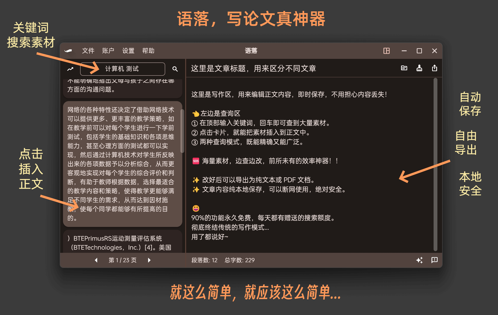
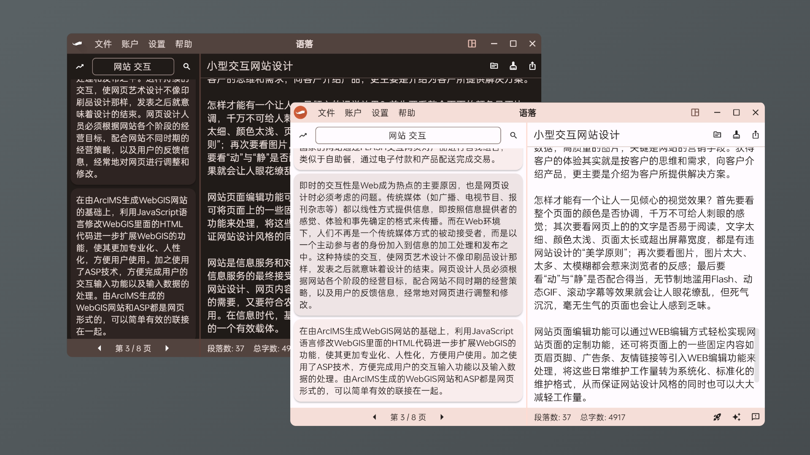
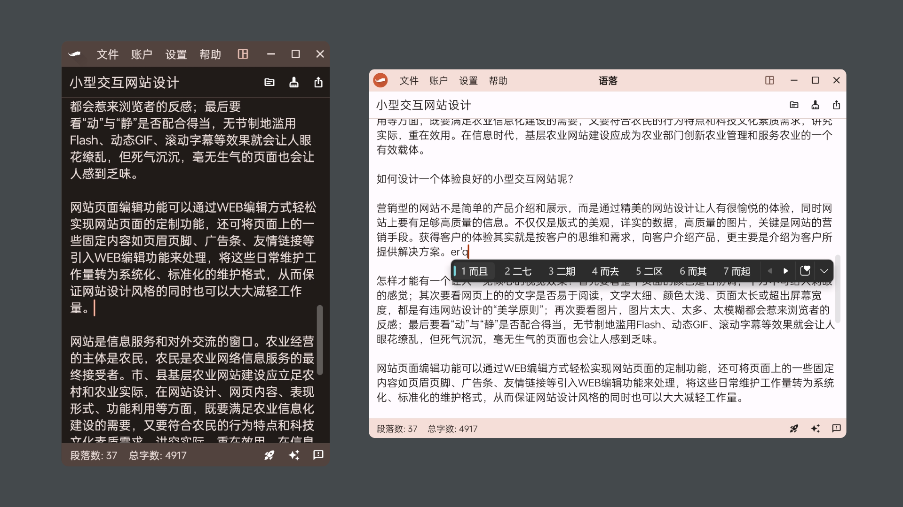
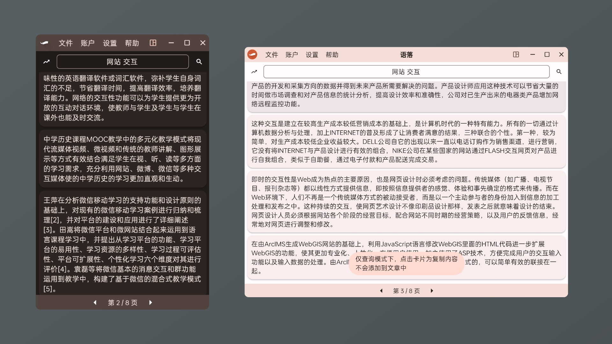
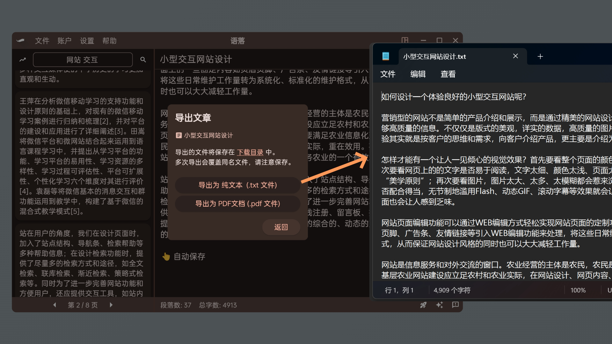

# 语落 

一个简单好用的论文效率工具，用于查素材和降重改写。

使用 Flutter 开发的原生桌面客户端，性能高体验好。
官网：https://yuluo.app/

概览：

> 注意，语落目前并未开源，本仓库仅用于提供安装包，方便境外用户下载。

## 下载

- [V1.0.1-Windows](https://github.com/NeroSong/yuluo-app/releases/download/V1/yuluo-installer-Win-x64-V1.0.1.exe)  ，欢迎体验。暂时只有 Windows 版本，Mac 版内测中。

## 功能截图

夜间模式，侧栏宽度调整：

仅写作模式布局：

仅查询模式布局：

文章导出：

> 欢迎体验！